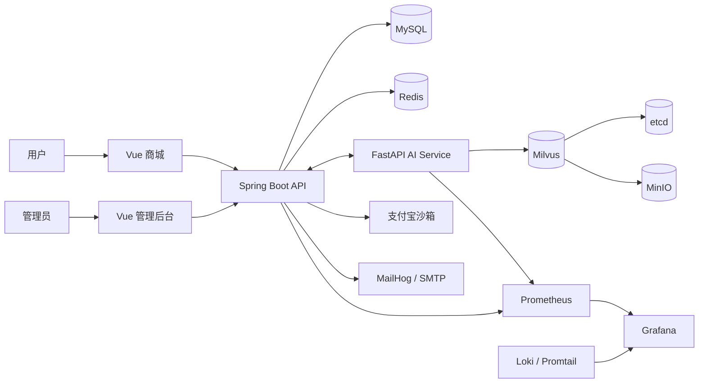

# AIMall

AIMall 是一个面向完整商城业务的 AI 电商项目，由 Spring Boot、Vue 3、FastAPI 和 Milvus 组成。项目同时提供用户商城、运营后台、交易履约、支付宝沙箱支付、AI Agent、RAG 知识库和可观测性组件。

当前发布版本：`1.0.0`

## 核心能力

- 商品、品牌、类目、SKU、库存、购物车和订单管理
- 优惠券、支付、退款、售后、物流、评价、收藏和浏览历史
- 管理员认证、RBAC、操作审计、登录风控和账户安全
- 支付宝沙箱下单、异步通知、主动查单、关单、退款和对账
- Outbox、幂等、状态机、并发库存控制和 Flyway 数据库迁移
- AI 对话、工具调用、Pending Action、会话记忆和人工确认
- RAG 文档解析、版本审核、质量评估、发布和 Milvus 向量同步
- Prometheus、Alertmanager、Loki、Promtail 和 Grafana 可观测性
- MailHog 本地邮件验证码调试

## 系统架构



## 技术栈

| 模块 | 主要技术 |
| --- | --- |
| 后端 | Java 17、Spring Boot 3.5、MyBatis-Plus、Sa-Token、Flyway |
| 用户端 | Vue 3、TypeScript、Vite、Pinia、Vue Router |
| 管理端 | Vue 3、TypeScript、Vite、Element Plus、Pinia |
| AI 服务 | Python、FastAPI、Pydantic、HTTPX、Redis |
| RAG | Milvus、PyMuPDF、python-docx、Embedding API |
| 数据设施 | MySQL 8、Redis 7、MinIO、etcd |
| 可观测性 | Prometheus、Alertmanager、Grafana、Loki、Promtail |

## 项目目录

```text
aimall-server/       Spring Boot 后端
aimall-web/          用户商城
aimall-admin/        运营管理后台
aimall-ai-service/   AI Agent 与 RAG 服务
docker/              Nginx 和可观测性配置
docs/                部署、架构、运维和知识规则文档
scripts/             数据库、验收和发布脚本
tools/               质量门禁、知识导入和运维工具
```

## Docker 快速启动

推荐使用完整 Docker 栈。它使用独立项目名、端口和数据卷，不会覆盖本地开发数据库或历史 Docker volume。

### 1. 准备配置

```powershell
Copy-Item .env.docker.example .env.docker.local
notepad .env.docker.local
```

必须替换文件中的示例密码、HMAC 密钥、观测 token 和管理员初始密码。没有支付宝沙箱密钥时，将 `ALIPAY_ENABLED` 设置为 `false`。

Prometheus 使用文件读取观测 token，该文件内容必须与 `.env.docker.local` 中的 `AIMALL_OBSERVABILITY_TOKEN` 完全相同：

```powershell
New-Item -ItemType Directory -Force .docker-secrets
Set-Content -NoNewline .docker-secrets/observability-token.txt "你的观测Token"
```

支付宝沙箱启用时，将密钥放在以下位置：

```text
secrets/alipay-sandbox/alipay-sandbox-app-private-key.pem
secrets/alipay-sandbox/alipay-sandbox-alipay-public-key.pem
```

上述本地配置和密钥目录均已被 `.gitignore` 排除。

### 2. 启动完整环境

```powershell
.\docker-full-start.bat
```

默认启动 15 个服务。首次构建需要下载 Maven、npm、Python 和 Docker 依赖。

### 3. 访问服务

| 服务 | 地址 |
| --- | --- |
| 用户商城 | http://localhost:15173 |
| 管理后台 | http://localhost:15174 |
| 后端健康检查 | http://localhost:18080/api/health |
| AI 健康检查 | http://localhost:18000/health |
| MailHog | http://localhost:18025 |
| MinIO 控制台 | http://localhost:19001 |
| Prometheus | http://localhost:19090 |
| Alertmanager | http://localhost:19093 |
| Grafana | http://localhost:13000 |

管理员账号由 `.env.docker.local` 中的 `AIMALL_ADMIN_BOOTSTRAP_USERNAME` 和 `AIMALL_ADMIN_BOOTSTRAP_PASSWORD` 初始化。

### 4. 停止服务

```powershell
.\docker-full-stop.bat
```

停止命令不会删除数据卷。除非明确需要永久清空 Docker 数据，否则不要执行 `docker compose down -v`。

完整说明参见 [Docker 全栈部署文档](docs/AIMALL_DOCKER_FULL_STACK.md)。

## 本地开发启动

本地运行需要：

- JDK 17 和 Maven 3.9+
- Node.js 22+ 和 npm
- Python 3.10+
- 可访问的 MySQL、Redis 和 Milvus

复制并填写本地配置：

```powershell
Copy-Item .env.example .env
notepad .env
```

启动四个应用服务：

```powershell
.\start.bat
```

也可以单独启动指定模块：

```powershell
powershell -ExecutionPolicy Bypass -File .\start-local.ps1 -Service server
powershell -ExecutionPolicy Bypass -File .\start-local.ps1 -Service web
powershell -ExecutionPolicy Bypass -File .\start-local.ps1 -Service admin
powershell -ExecutionPolicy Bypass -File .\start-local.ps1 -Service ai
```

本地默认端口：商城 `5173`、管理后台 `5174`、Java `8080`、AI `8000`。

## 支付宝沙箱

沙箱支付需要配置 APPID、商户 PID、应用私钥、支付宝公钥、网关地址、同步返回地址和公网异步通知地址。公网回调推荐使用 Cloudflare Named Tunnel：

```powershell
.\docker-full-start.bat -Tunnel
```

启用前必须提供 `CLOUDFLARE_TUNNEL_TOKEN`，并将 `ALIPAY_NOTIFY_BASE_URL` 设置为稳定的 HTTPS 地址。不得把沙箱账号、支付密码或私钥提交到 GitHub。

## 测试与构建

Java：

```powershell
Set-Location aimall-server
mvn test
```

AI 服务：

```powershell
Set-Location aimall-ai-service
python -m pip install -r requirements-dev.txt
python -m pytest
```

用户商城：

```powershell
Set-Location aimall-web
npm ci
npm test
npm run build
```

管理后台：

```powershell
Set-Location aimall-admin
npm ci --legacy-peer-deps
npm run build
```

Compose 配置校验：

```powershell
docker compose --env-file .env.docker.local -f docker-compose.full.yml config --quiet
```

部分真实 MySQL、Redis、Milvus、支付宝和外部模型测试需要单独的环境与凭据，默认测试配置可能不会执行这些集成用例。

## 配置与安全

- 真实配置只写入 `.env` 或 `.env.docker.local`。
- 私钥和 token 只保存在 `secrets/`、`.docker-secrets/` 或正式密钥管理系统中。
- 生产环境必须关闭模拟支付、API 文档和不必要的健康详情。
- Java 与 AI 服务通过双向 HMAC 保护内部业务接口。
- 数据库变更必须通过 Flyway 管理，不应直接修改生产 schema。
- 上传、支付、退款、管理员和 AI Action 功能上线前应执行对应安全与故障测试。

## 相关文档

- [部署手册](docs/AIMALL_DEPLOYMENT_GUIDE.md)
- [Docker 全栈说明](docs/AIMALL_DOCKER_FULL_STACK.md)
- [支付宝沙箱支付方案](docs/AIMALL_ALIPAY_SANDBOX_PAYMENT_PLAN.md)
- [AI Agent 开发规范](docs/AI_AGENT_DEVELOPMENT_SPEC.md)
- [AI Agent 通用指南](docs/AI_AGENT_GENERAL_GUIDE.md)
- [RAG 开发方案](docs/AIMALL_RAG_DEVELOPMENT_PLAN.md)
- [脚本依赖清单](docs/SCRIPT_INVENTORY.md)
- [变更记录](CHANGELOG.md)

## 许可证

当前仓库尚未包含开源许可证。公开发布前请根据项目用途添加合适的 `LICENSE` 文件；在许可证明确前，不应视为已经授予复制、修改或商业使用权限。
